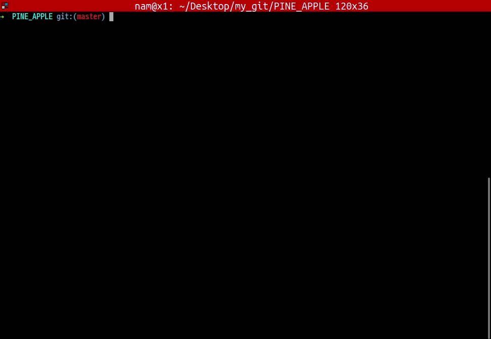

# :pineapple: PINE APPLE SHELL
***minishell by [gmoon](https://github.com/moon9ua) and [sanam](https://github.com/simian114).*** 
***@ 42 Seoul***

### 2020. 05. 17
* [x] 따옴표 안의 명령어 처리.
* [x] fork로 안되는 함수(cd, export, unset, exit ...) 처리.

### 2020. 05. 18
* [x] triple_char_free() 추가.
* [x] sh_exec(): argv 받도록 수정.
* [x] print_art(): 메모리 누수 수정.
* [x] is_command() 삭제 후 is_same()으로 통일.
* [x] exec_line(): valgrind 에러 수정.
* [x] envs free 추가.

### 2020. 05. 19
* [x] cd, pwd, clear, env 에러처리
	- cd : 몇 가지 에러 추가
	- pwd : 인자가 2 개 이상인 경우 에러
	- clear : 인자가 2 개 이상인 경우 에러
	- env : 인자가 2 개 이상인 경우 에러
* [x] store_status():  
	exec_line 함수 마지막에 함수가 종료되면 상태를 그 상태를 저장한다.  
	기본적으로 환경변수에 key(?)를 추가하고 wstatus을 value로 넣는다.  
	env에서는 출력되지 않게 구현.
* [x] ctrl + d (EOF)
* [x] $? 구현. > export, unset 제외하고 함. 이 녀석들은 추후 에러 찾고 추가할 것.
* [x] export, unset, cd 같이 fork 안하는 함수들도 리다이렉션 되게 수정.
* [x] 에러 처리.
* [x] 그냥 echo만 해도 $?가 139인거 수정.
* [x] echo "$HOME>me" 추가. (다른 특수문자는 아직 추가 안함)
* [x] `> a` 처리.
* [x] `echo hello > a asdf`와 같은 경우 asdf도 인자로 들어가게 수정.
* [x] 마지막에 개행이 없는 경우, %가 붙어야 하는데 어떻게 하지?  
	-> bash에서는 %\n의 출력이 안되는 것으로 확인.

### 2020. 05. 20
* [x] makefile에 빌트인 함수들은 따로 폴더를 만들까?
* [x] `echo a >>> b`, `echo a << b`, `echo a <<< b` 등 에러.
* [x] signal 처리

### 2020. 05. 21
* [x] Signals
* [x] Double Quotes
* [x] export
* [x] Environment Path